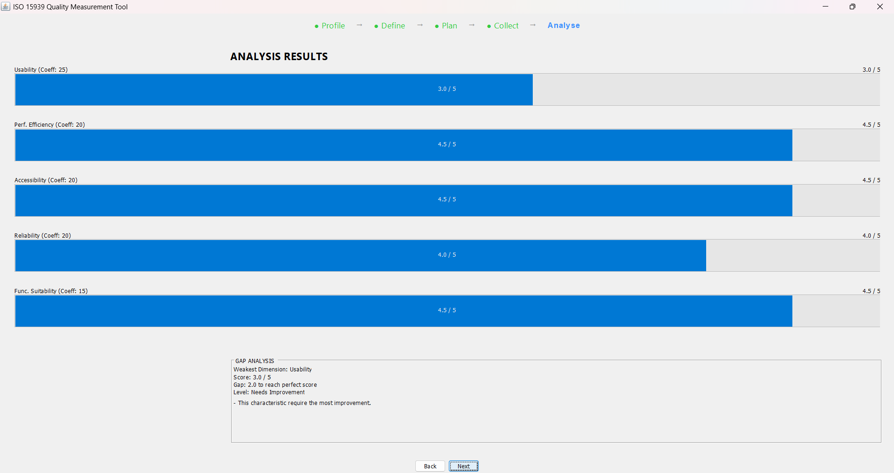

# ISO 15939 Software Quality Measurement Tool

## Student Information
- **Name:** Nasser Mahanamt Adoum
- **Student ID:** 202228524
- **Course:** SENG 272


## Description
A Java Swing desktop application that simulates the 5 core steps of the ISO/IEC 15939 software measurement process standard.

## Features
- Step 1: Profile - User information input
- Step 2: Define - Quality type, mode, add scenario selection
- Step 3: Plan - Read-only metrics display
- Step 4: Collect - Editable value entry with automatic score calculation
- Step 5: Analyse - Dimension scores with progress bars and gap analysis
- Step indicator showing current and completed steps

## How to Compile and Run

### Compile
```bash
javac -d out -sourcepath src src/GUI/MainFrame.java


// Run
java -cp out GUI.MainFrame
```

## Screenshot

